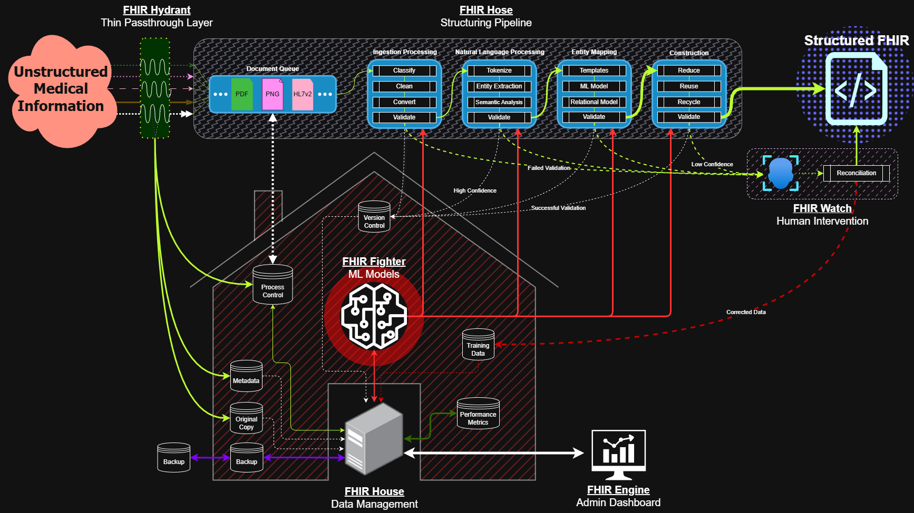

# FHIR 🔥 Department

The FHIR Department is a comprehensive system for processing and converting
unstructured medical information into standardized FHIR (Fast Healthcare
Interoperability Resources) format. The system employs a pipeline architecture
with multiple specialized components working together to ensure accurate and
reliable data transformation.

## 🏗️ Architecture Overview

The system consists of five main components, each handling specific aspects of
the FHIR conversion process:

### 🚰 FHIR Hydrant (Thin Passthrough Layer)
- Functions as the initial entry point for unstructured medical information
- Manages initial data routing
- Ensures consistent data flow into the processing pipeline
- Creates shortest possible feedback loop ensuring quickest response

### 🌊 FHIR Hose (Structuring Pipeline)
Consists of four major processing stages:

1. **Ingestion Processing**
   - Classify: Identifies document types and content
   - Clean: Removes noise and standardizes input
   - Convert: Transforms data into processable format
   - Validate: Ensures data quality before further processing

2. **Natural Language Processing**
   - Tokenize: Breaks down text into analyzable units
   - Entity Extraction: Identifies medical terms and concepts
   - Semantic Analysis: Understands context and relationships
   - Validate: Verifies extracted information

3. **Entity Mapping**
   - Templates: Applies standardized FHIR templates
   - ML Model: Uses machine learning for entity mapping
   - Relational Model: Maps relationships between entities
   - Validate: Ensures correct mapping

4. **Construction**
   - Reduce: Consolidates mapped information, deduplicates
   - Reuse: Leverages existing FHIR resources and outside validations
   - Recycle: Optimizes resource usage
   - Validate: Final validation before output

### 🥊 FHIR Fighter (ML Models)
- Central ML processing hub
- Handles complex pattern recognition
- Provides confidence scoring for validations
- Continuously learns from processed data
- Interfaces with version control system

### 🏠 FHIR House (Data Management)
- Manages data storage and versioning
- Maintains original copies and metadata
- Handles backup and recovery
- Provides process control mechanisms
- Tracks performance metrics

### 🔍 FHIR Watch (Human Intervention)
- Manages cases requiring manual review
- Handles low-confidence predictions
- Provides reconciliation interface
- Feeds corrections back to training data
- Ensures quality control

### 📊 FHIR Engine (Admin Dashboard)
- Provides system monitoring and control
- Displays performance metrics
- Manages system configuration
- Enables administrative oversight

## 🔄 Data Flow

1. Unstructured medical information enters through FHIR Hydrant
2. FHIR Hose processes the data through its pipeline stages
3. FHIR Fighter provides ML support throughout processing
4. FHIR House manages storage and versioning
5. FHIR Watch handles exceptions and manual review
6. Final structured FHIR data is produced and validated

## 🛡️ Validation & Quality Control

The system implements multiple validation layers:
- Stage-specific validation after each processing step
- Confidence scoring for ML predictions
- Version control for all processed data
- Human review for low-confidence cases
- Performance metrics tracking
- Automated backup and recovery

## 📈 Performance Monitoring

Performance is tracked through:
- Processing metrics at each pipeline stage
- ML model accuracy metrics
- System throughput measurements
- Error rates and types
- Manual intervention frequency
- Resource utilization statistics

## 🚀 Getting Started

[setup and installation instructions]

## 📚 Documentation

[links to documentation]

## 🤝 Contributing

[contribution guidelines and requirements]

## 📄 License

[license]

## 🔗 Related Projects

[links to related projects]
